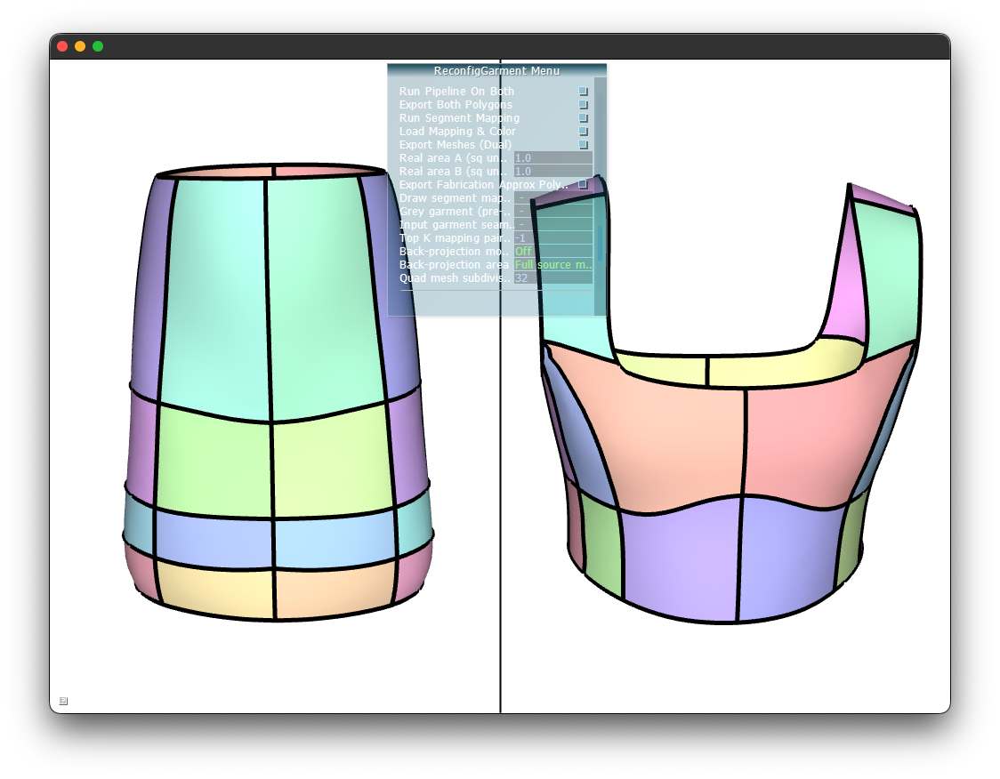

# reconfigGarment

reconfigGarment shows two garments side by side, saves and loads experiments, and maps segments between them with [MappingSolver](MappingSolver/README.md). It is built on top of [parafashion](https://github.com/nicopietroni/parafashion).



Sources in this folder:

- `apps/reconfigGarment.cpp`
- `include/reconfigGarment_widget.h`
- `include/dualglwidget.h`
- `include/experiment_settings.h`
- `include/garment_session.h`
- `include/manual_border_seam.h`
- `src/reconfigGarment_widget.cpp`
- `src/dualglwidget.cpp`
- `src/experiment_settings.cpp`
- `src/garment_session.cpp`
- `src/manual_border_seam.cpp`

`MappingSolver/` is the Python segment-mapping solver used by the dual app.

## Install

Clone parafashion with its submodules, then copy these dual sources into that tree so the relative paths match:

```bash
git clone --recursive https://github.com/nicopietroni/parafashion
cd parafashion
git submodule update --init --recursive

# From this Code directory:
cp -R apps include src /path/to/parafashion/
```

The reconfigGarment target in `CMakeLists.txt` is:

```cmake
add_executable(reconfigGarment ${SRC_VCGLIB} apps/reconfigGarment.cpp src/reconfigGarment_widget.cpp ${SRCPARAM})
target_link_libraries(reconfigGarment PRIVATE ${VCG_UI_LIBS} nlohmann_json woven_param)
```

Required packages: `qt5-default libqt5svg5-dev freeglut3-dev` (for example `sudo apt install ...` on Debian). On macOS, install Qt 5 (Homebrew `qt@5`), plus OpenGL and GLUT. This code is built and tested on macOS with Apple M3 silicon.

```bash
mkdir build
cd build
cmake ..
make -j reconfigGarment
```

Run with two garment meshes, or with a saved experiment under `exp/`:

```bash
./reconfigGarment <garment_mesh_1> <garment_mesh_2>
./reconfigGarment --experiment <name under exp/>
```

## MappingSolver

MappingSolver matches pattern segments between the two garments with a mixed-integer program and a turning-function polygon distance.

The dual app starts `../segmentMappingSolver/run_mapping_solver.py` from the build directory, and it looks for a project root that contains `CMakeLists.txt`, `src/`, and a directory named `segmentMappingSolver`. Copy `MappingSolver` into the project under that name:

```bash
cp -R MappingSolver /path/to/parafashion/segmentMappingSolver
cd /path/to/parafashion/segmentMappingSolver
pip install -r requirements.txt
```

The solver also needs the external `turning_function` module on `PYTHONPATH`. The app launches the script with `python`.

You can run it on polygon exports directly:

```bash
python run_mapping_solver.py garment1_polygons.txt garment2_polygons.txt output_mapping.txt
```

It writes:

- `output_mapping.txt` — segment index pairs with scores and rigid transforms
- `output_mapping_quads.txt` — fitted approximate polygons

| Variable | Default | Description |
|----------|---------|-------------|
| `PARAFASHION_QUAD_WORKERS` | auto | Parallel workers for polygon fitting |
| `PARAFASHION_QUAD_BACKEND` | `process` | `process`, `thread`, or `serial` |
| `PARAFASHION_APPROX_VERTICES` | `4,5` | Candidate vertex counts for the approximate fit |

## Output

A dual export (default folder name `dual_export`) contains:

- Original meshes, per-patch meshes, and flattened segment meshes for both garments
- Segment polygons, approximate polygons, and back-projected meshes
- The segment mapping produced by MappingSolver

Saved experiments live under `exp/<name>/`.

<small>To-Dos: CMake compilation setup, data, and running a debug build.</small>
